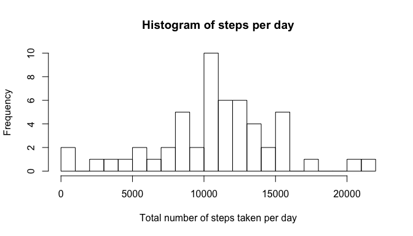
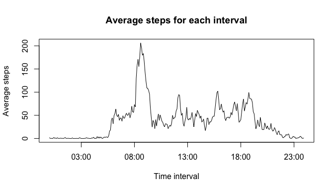

# Reproducible Research: Peer Assessment 1


## Loading and preprocessing the data

Data for this assignment is downloaded from course website, [Activity monitoring data](https://d396qusza40orc.cloudfront.net/repdata%2Fdata%2Factivity.zip).


```r
library(plyr)
library(dplyr)
```

```
## 
## Attaching package: 'dplyr'
## 
## The following objects are masked from 'package:plyr':
## 
##     arrange, count, desc, failwith, id, mutate, rename, summarise,
##     summarize
## 
## The following object is masked from 'package:stats':
## 
##     filter
## 
## The following objects are masked from 'package:base':
## 
##     intersect, setdiff, setequal, union
```

```r
library(stringr)
library(lubridate)
```

```
## 
## Attaching package: 'lubridate'
## 
## The following object is masked from 'package:plyr':
## 
##     here
```

```r
library(ggplot2)

dat <- read.csv("activity.csv", header = T, sep = ",")
dat1 <- mutate(dat, date_ts = ymd_hm(paste(dat$date, str_pad(dat$interval, 4, pad = 0), sep = ":")))
dat1 <- dat1[, c(1,4)]
dat1 <- dat1[which(!is.na(dat1$steps)), ]
date <- format(dat1$date_ts, "%Y-%m-%d")
interval <- format(dat1$date_ts, "%H:%M:%S")
dat1 <- cbind(dat1, date, interval)
```


## What is mean total number of steps taken per day?

1. Calulate the total number of steps taken per day.


```r
sdat <- summarize(group_by(dat1, date), steps_sum = sum(steps))
```


2. Plot histogram of the total number of steps taken per day


```r
hist(sdat$steps_sum, breaks = 20, main = "Histogram of steps per day", xlab = "Total number of steps taken per day")
```

 

3. Calculate mean and median of the total steps taken per day

Mean of total number of steps taken per day is 1.0766189\times 10^{4}.

Median of total number of steps taken per day is 10765.

## What is the average daily activity pattern?

1. Make a time series plot of the 5-minute interval (x-axis) and the average number of steps taken, averaged across all days (y-axis)

The below plot shows the average number of steps taken for each time interval across all days. In this plot the missing values are ignored.
The average number of steps acroos all days is zero during midnight - early morning hours. Which shows that most likely the sujects are sleeping during this time period. It peaks between the usual commute hours, 8:00 AM -10:00AM. Then this value is mostly less than half the peak value. We can guess, that the subjects are stabilized in their movements and the activity is not as much instance as during commute hours. The we see that the values starts decreasing late in the evening, showing subjects are slowing down, may be preapring for good night rest.


```r
sdat_int <- summarize(group_by(dat1, interval), steps_mean = mean(steps))
```

```r
with(sdat_int, plot(as.POSIXct(strptime(sdat_int$interval, "%H:%M:%S")), steps_mean, main = "Average steps for each interval", type = "l", xlab = "Time interval", ylab = "Average steps"))
```

 

2. Which 5-minute interval, on average across all the days in the dataset, contains the maximum number of steps?

The time interval 08:35:00, contains the maximum average steps across all days.


## Inputing missing values

1. Report the total missing values.

There are 2304 missing values in this dataset.

2. Fill all of the missing values in the datasetn and create new dataset.

My approach to fill missing values is to take mean of steps taken during the interval across all days. Use this mean value to replace the missing values for each time interval.


```r
dat2 <- mutate(dat, date = ymd(dat$date), date_ts =  ymd_hm(paste(dat$date, str_pad(dat$interval, 4, pad = 0),sep = ":")))

dat2 <- mutate(dat2, interval = format(dat2$date_ts, "%H:%M:%S"))

print(head(dat2))
```

```
##   steps       date interval             date_ts
## 1    NA 2012-10-01 00:00:00 2012-10-01 00:00:00
## 2    NA 2012-10-01 00:05:00 2012-10-01 00:05:00
## 3    NA 2012-10-01 00:10:00 2012-10-01 00:10:00
## 4    NA 2012-10-01 00:15:00 2012-10-01 00:15:00
## 5    NA 2012-10-01 00:20:00 2012-10-01 00:20:00
## 6    NA 2012-10-01 00:25:00 2012-10-01 00:25:00
```

```r
dat3 <- c()

## Create function to replace missing values

replace_na <- function(){
  
  # read each row of df and replace NA value with mean for that time interval
  for (i in 1:nrow(dat2)) {
    x <- dat2[i, c(1)]
    int <- dat2[i, c(3)]
    # if steps is null replace it with mean for that interval
    if (is.na(x) == TRUE) { 
      x <- mean(dat2[which(dat2$interval == int), c(1)], na.rm = T)
      dat2[i, c(1)] <- x
      ##print(dat2[i,])
      
    }
      
  }
  dat3 <- dat2
  dat3
}

dat3 <- replace_na()

print(head(dat3))
```

```
##       steps       date interval             date_ts
## 1 1.7169811 2012-10-01 00:00:00 2012-10-01 00:00:00
## 2 0.3396226 2012-10-01 00:05:00 2012-10-01 00:05:00
## 3 0.1320755 2012-10-01 00:10:00 2012-10-01 00:10:00
## 4 0.1509434 2012-10-01 00:15:00 2012-10-01 00:15:00
## 5 0.0754717 2012-10-01 00:20:00 2012-10-01 00:20:00
## 6 2.0943396 2012-10-01 00:25:00 2012-10-01 00:25:00
```

3. Make a histogram of the total number of steps taken each day.

First, I summarized the total number of steps taken each day in a new data frame.


```r
sdat3 <- summarize(group_by(dat3, date), steps_sum = sum(steps))
```

Below is the histogram, showing the distribution of total no. of steps taken for each day.


```r
  hist(sdat3$steps_sum, breaks = 20, main = "Histogram of steps per day after replacing missing values", xlab = "Total number of steps taken per day")
```

 


4. Calculate the mean and median of the total number of steps taken per day.

After replacing the missing values, the mean and median of the total number os steps taken during per day are, 1.0766189\times 10^{4} and 1.0766189\times 10^{4}.

The mean and median values are unchanged after replacing the missing values with the mean across each day. This means, that my assumption didn't eschew the data distribution and hence not changing any conclusion derived from this dataaset. The histogram is also showing very similar data distribution.

## Are there differences in activity patterns between weekdays and weekends?

1. Create a new factor variable in the dataset with two levels - "weekday" and "weekend".


```r
dat3 <- mutate( dat3, weekday <- weekdays(date))
colnames(dat3)[5] <- "weekday"

## Create function to replace weekdays labels

is_weekday <- function(){
# read each row of df and replace weedays label to "weekday" or "weekend"
  for (i in 1:nrow(dat3)) {
    x <- dat3[i, c(5)]
    # replace weekdays names to weekend/weekday
    if (x == "Saturday" | x == "Sunday") {
      x <- "weekend"
    }
    else { x <- "weekday"}
    dat3[i, c(5)] <- x
 }
 dat4 <- dat3
 dat4
}

## Two level data frame is created, showing the day is weekday or weekend
dat4 <- is_weekday()
print(head(dat4))
```

```
##       steps       date interval             date_ts weekday
## 1 1.7169811 2012-10-01 00:00:00 2012-10-01 00:00:00 weekday
## 2 0.3396226 2012-10-01 00:05:00 2012-10-01 00:05:00 weekday
## 3 0.1320755 2012-10-01 00:10:00 2012-10-01 00:10:00 weekday
## 4 0.1509434 2012-10-01 00:15:00 2012-10-01 00:15:00 weekday
## 5 0.0754717 2012-10-01 00:20:00 2012-10-01 00:20:00 weekday
## 6 2.0943396 2012-10-01 00:25:00 2012-10-01 00:25:00 weekday
```
2. Make a panel plot containing a time series plot (i.e. type = "l") of the 5-minute interval (x-axis) and the average number of steps taken, averaged across all weekday days or weekend days (y-axis)

I created two separate datasets to store the rows for weekends and weekdays.


```r
dat4_0 <- dat4[which(dat4$weekday == "weekday"),]
dat4_0 <- mutate(dat4_0, interval = format(dat4_0$date_ts, "%H:%M:%S"))
sdat_0 <- summarize(group_by(dat4_0, interval), steps_mean = mean(steps))

dat4_1 <- dat4[which(dat4$weekday == "weekend"),]
dat4_1 <- mutate(dat4_1, interval = format(dat4_1$date_ts, "%H:%M:%S"))
sdat_1 <- summarize(group_by(dat4_1, interval), steps_mean = mean(steps))
```

The pattern of average steps taken per day for each 5 minute interval on weekdays is differnt from weekends. The average on weekend remains high during afternoon, as compared to on weekdays. This might indicate that subject is likely to be engaged in more physical work or outdoor activites on weekend. The subject might have desk job or a stationary job, which is influecing the pattern of daily steps.


```r
par(mfrow = c(1,2))
with(sdat_0, plot(as.POSIXct(strptime(sdat_0$interval, "%H:%M:%S")), steps_mean, main = "Average steps on weekdays", type = "l", xlab = "Time interval", ylab = "Average steps"))
      
with(sdat_1, plot(as.POSIXct(strptime(sdat_1$interval, "%H:%M:%S")), steps_mean, main = "Average steps on weekends", type = "l", xlab = "Time interval", ylab = "Average steps)"))
```

 
